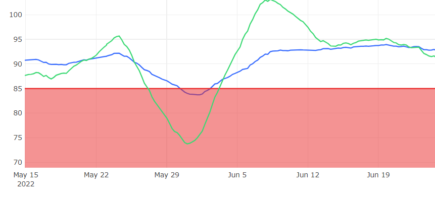
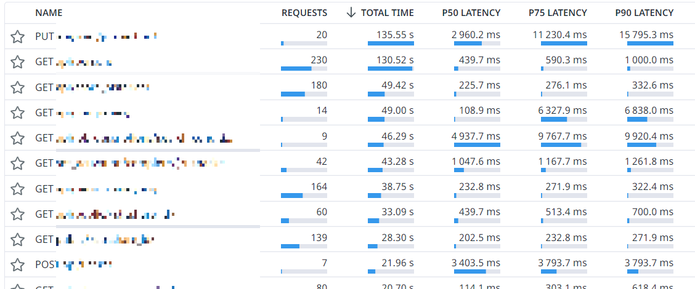
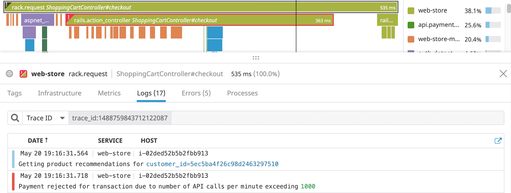
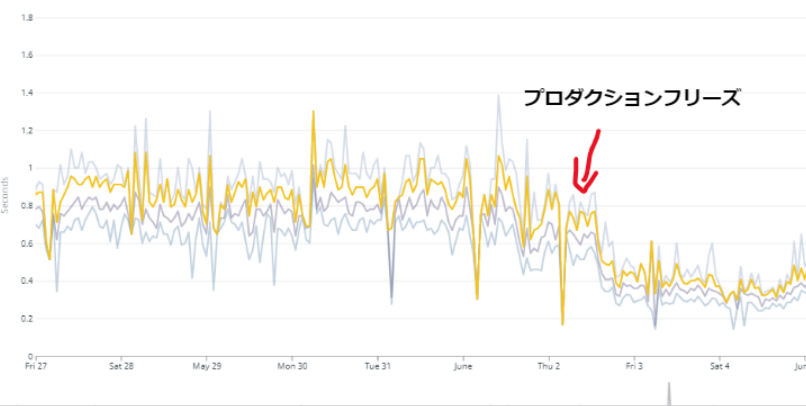
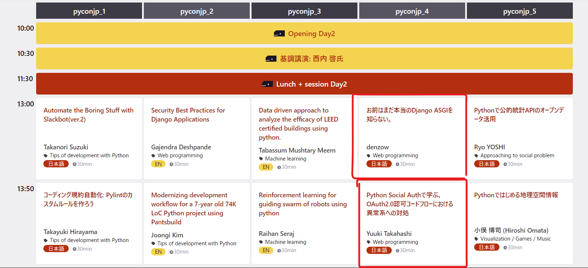
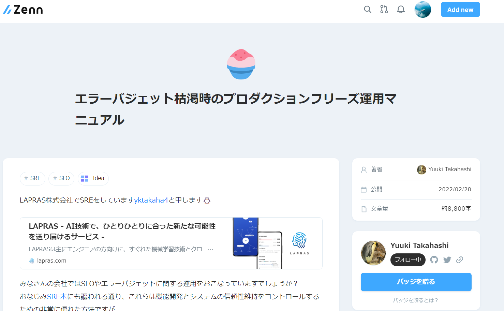

### 顧客に指摘される前に 改善の意思決定をする仕組みで、 Djangoアプリケーションの パフォーマンス改善をした記録

LAPRAS Inc.　増川 武志

---

### 自己紹介
- LAPRAS株式会社(2022/01~)
    - Djangoアプリケーション(LAPRAS)開発
    - データアナリスト
- 医療者向けプロトタイピングスクール 「もいせん」の講師
- Windows, WSL, VSCode, NeoVim
- Nizキーボード
- 前職でAzure, C#, .Netをやっていた名残で MS系への親しみが深い

---

### プロダクションフリーズ という仕組み

---

### DevとSREの約束

エラーバジェットが枯渇したときは、 新機能開発を停止し、指標改善にコミットする

---

300ms以内に完了する APIレスポンスの割合が85%以上

---

## ボトルネックの調査

---

### 遅い & 呼び出し回数が多い APIの特定
DataDogのAPM

  

---

### APIの内側の処理を分析
  
<small>https://docs.datadoghq.com/ja/tracing/</small>

---

### 調査結果
- 決定的なボトルネックはない
- 最近急に遅くなったわけでもない

細かな無駄が積み上がった結果 じわじわと遅くなり、SLOを下回った

---

## 改善開発

潔く細かな無駄をひとつひとつ潰していく

---

### やったこと
- N+1 問題の解消
- DBから必要なカラムだけ取得する
- DB側でLIMIT句をつけて取得データ量を減らす
    - アプリケーション側で`slice()`しない
- 件数だけ欲しいときはDB側で`count()`を使う
    - 全件取得してから`len()`しない
- 結果が全く利用されてないgRPC呼び出しの削除
- gRPCのstreamをrepeatedに変更

---

- 一気に開発するのではなく、 細かくリリースして本番でのSLOの変化を観察する

---

### 最終結果
レスポンスタイムの中央値
658ms → 282ms

  

---

### 学んだこと
- 普段から気をつけていても、 無駄な処理は知らぬ間に積み上がる
- 予め指標を用意し、下回れば指標復活まで 改善に集中する！という運用のメリット
    - 普段は新機能開発に集中できる
    - 顧客に指摘される前に 改善開発の意思決定ができる

---

## 宣伝

---

  

---

### 明日弊社メンバーが登壇します！
  

---

 

<small>https://zenn.dev/yktakaha4/articles/production_freeze_manual</small>

---